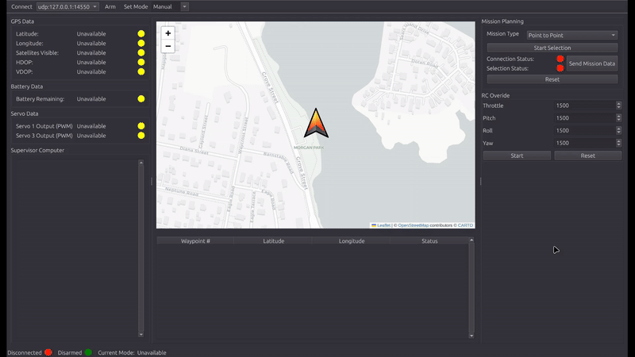
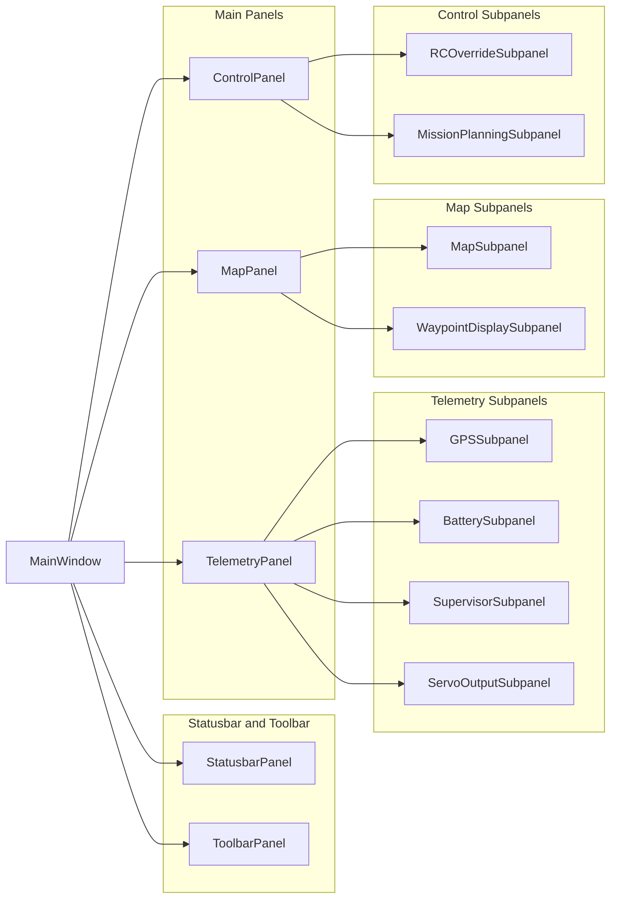
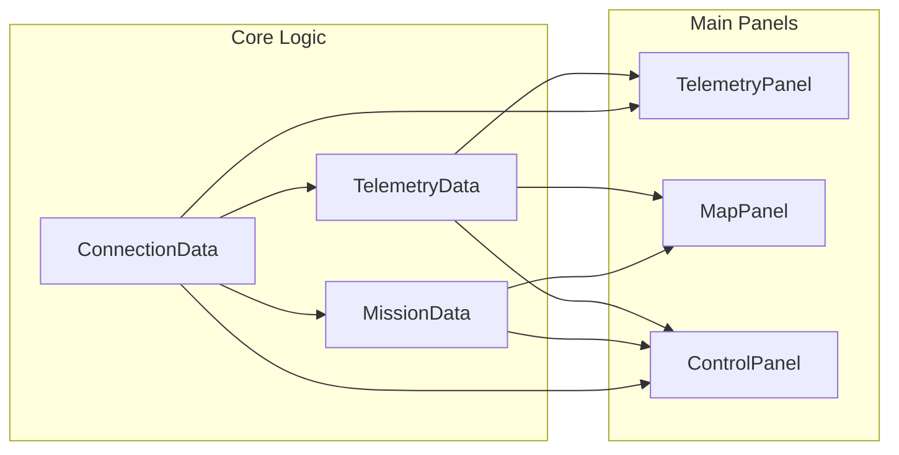

# WPilot - Ground Control Station Software

WPilot is a ground control station (GCS) software developed by Nicole Duong, Will Gerlach, and Benjamin Howes for use in the Major Qualifying Project entitled, "Autonomous Surface Vehicle for Shallow Water Bathymetry." Developed with ease of use in mind, this GCS allows the user to easily plan missions, change modes, observe messages from the vehicle's companion computer, and track vital telemetry data. WPilot utilizes pymavlink to communicate via MAVLink to an autopilot running ArduPilot Rover firmware, leverages folium to display map data, and generates a UI using PyQt6. 

## Demo


WPilot being used to create, send, and monitor a point to point mission. [Software in the Loop](https://ardupilot.org/dev/docs/sitl-simulator-software-in-the-loop.html) simulation used to generate data.

## Key Features
- Real-time telemetry data display
- Point and click waypoint planning
- RC override
- Vehicle mode switching
- Companion computer message monitoring
- Interactive map

## System Architecture
**UI Diagram**

**Core Logic Diagram**


## Installation and Running
1. Clone the repository into a directory of your choosing:
```bash
git clone https://github.com/wsgerlach/WPIlot-ASV.git
```
2. Create a virtual environment inside the cloned repository:
```bash
python3 -m venv .venv
```
3. Activate the virtual environment:
```bash
source .venv/bin/activate
```
4. Install the necessary dependencies using requirements.txt:
```bash
pip install -r requirements.txt
```
5. Start the program using main.py:
```bash
python3 main.py
```
